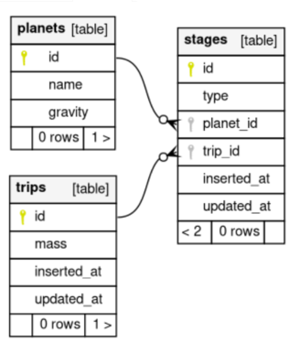

# SpaceMission
<p align="center">
  
</p><br />
## Background
In order to store input information of the form:
```elixir
{28801, [{:land, 9.807}, {:launch, 1.62}]}
```
I came up with three entities as follows:
* *Trip* -> _represents a space mission_
* *Stage* -> _part of the mission, e.g. landing on Moon_
* *Planet* -> _entity for spatial object we can travel to_

Their relationship is best described with a snapshot of the db:<br />




To have a predictable behaviour, limitations were introduced:
* Having a predefined set of planets, that abide laws of the universe ([seeds](./priv/repo/seeds.exs))
* Space mission is not valid under conditions:
  * we land on one planet and launch from another one
  * land or launch multiple times in a row

## Requirements
* *Postgres database*

## Installation
```bash
mix deps.get
make db_create
make db_migrate
```

## Running
To run seeds file (will fill up the databse with task entries
```bash
cd ../.. && make db_update
```
or simply with tests
```bash
mix test
```

Documentation can be generated with [ExDoc](https://github.com/elixir-lang/ex_doc)
and published on [HexDocs](https://hexdocs.pm). Once published, the docs can
be found at [https://hexdocs.pm/space_mission](https://hexdocs.pm/space_mission).
